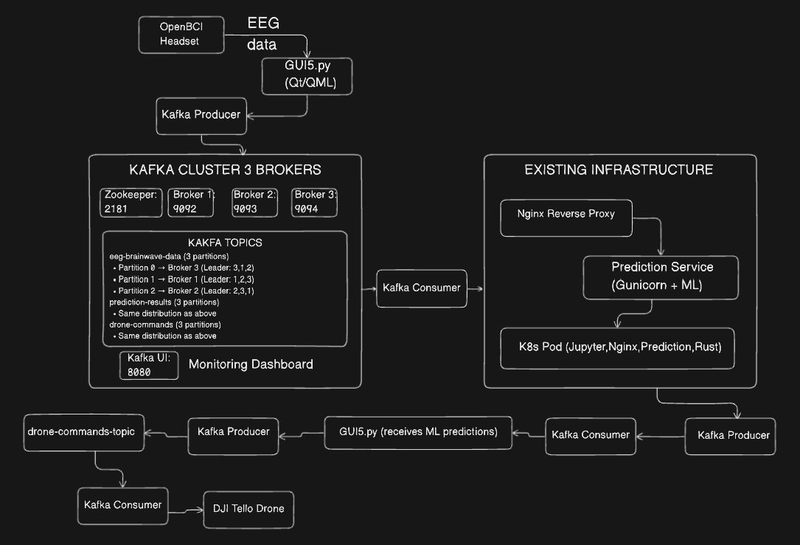

# Kafka Cluster for Avatar Project

This directory contains the Kafka cluster implementation for issue #338 - creating a 3-node Kafka cluster to handle real-time EEG data streaming in the Avatar project.

## Overview

The Kafka cluster provides distributed message streaming for the Avatar brainwave-to-drone control pipeline:

- **3 Kafka Brokers**: Distributed across available servers
- **3 Partitions per Topic**: Each partition on a different broker for maximum distribution
- **EEG Data Streaming**: Real-time brainwave data from GUI5.py to ML prediction services
- **Integration Ready**: Works with existing MicroK8s and nginx infrastructure

## Target Architecture



### Topics Created

1. **eeg-brainwave-data**: Streams EEG data from OpenBCI headset via GUI5.py
2. **prediction-results**: ML prediction results from the gunicorn prediction service
3. **drone-commands**: Final commands to execute on DJI Tello drones

Each topic has:
- 3 partitions (distributed across 3 brokers)
- Replication factor of 3 (fault tolerance)
- Appropriate retention policies for real-time processing

## Quick Start with Docker Compose

### Prerequisites
- Docker and Docker Compose installed
- At least 4GB RAM available for containers

### Run the Cluster

```bash
# Start the entire Kafka cluster
docker-compose up -d

# Wait for cluster to be ready (about 30 seconds)
sleep 30

# Create the Avatar-specific topics
./scripts/setup-topics.sh

# Check cluster status
docker-compose ps

# View Kafka UI (optional)
open http://localhost:8080
```

### Verify the Setup

```bash
# List all topics
docker exec kafka-broker-1 kafka-topics --list --bootstrap-server kafka-broker-1:29092

# Check topic details
docker exec kafka-broker-1 kafka-topics --describe --topic eeg-brainwave-data --bootstrap-server kafka-broker-1:29092

# Test producer
docker exec -it kafka-broker-1 kafka-console-producer --topic eeg-brainwave-data --bootstrap-server kafka-broker-1:29092

# Test consumer (in another terminal)
docker exec -it kafka-broker-1 kafka-console-consumer --topic eeg-brainwave-data --from-beginning --bootstrap-server kafka-broker-1:29092
```

# SSL/TLS Encryption

The Kafka cluster is configured with SSL encryption for secure communication.

## SSL Ports

- **Broker 1**: 9192 (SSL), 9092 (PLAINTEXT)
- **Broker 2**: 9193 (SSL), 9093 (PLAINTEXT)
- **Broker 3**: 9194 (SSL), 9094 (PLAINTEXT)

## Certificate Setup

SSL certificates are automatically generated when you run:

```bash
./scripts/generate-ssl-certs.sh
```

This creates:

- Self-signed Certificate Authority (CA)
- Individual keystores for each broker
- Truststores containing the CA certificate

## Client Connection with SSL

To connect to the encrypted Kafka cluster, clients need the CA certificate.

### Python Example

```python
from kafka import KafkaProducer
import ssl

producer = KafkaProducer(
    bootstrap_servers=['localhost:9192'],
    security_protocol='SSL',
    ssl_cafile='kafka-cluster/ssl-certs/ca-cert'
)

producer.send('eeg-brainwave-data', b'encrypted message')
```

### Java Example

```java
Properties props = new Properties();
props.put("bootstrap.servers", "localhost:9192");
props.put("security.protocol", "SSL");
props.put("ssl.truststore.location", "kafka-cluster/ssl-certs/broker1.truststore.jks");
props.put("ssl.truststore.password", "kafka-broker-password");
```

## Production Considerations

For production environments:

- Replace self-signed certificates with CA-signed certificates
- Implement proper certificate rotation policies
- Use secure password management for keystores and truststores


## Kubernetes Deployment

For production deployment on the existing MicroK8s cluster:

```bash
# Apply the Kafka cluster to K8s
kubectl apply -f k8s/kafka-cluster.yaml

# Check pod status
kubectl get pods -l app=kafka

# Check services
kubectl get services -l app=kafka

# Create topics (once all pods are running)
kubectl exec -it kafka-broker-1-0 -- kafka-topics --create --topic eeg-brainwave-data --bootstrap-server kafka-broker-1:29092 --partitions 3 --replication-factor 3
```

## Integration with Existing Avatar Components

### GUI5.py Integration
Replace direct HTTP calls to prediction service with Kafka producers:

```python
from kafka import KafkaProducer
import json

producer = KafkaProducer(
    bootstrap_servers=['localhost:9092', 'localhost:9093', 'localhost:9094'],
    value_serializer=lambda v: json.dumps(v).encode('utf-8')
)

# Send EEG data to Kafka instead of direct HTTP
producer.send('eeg-brainwave-data', eeg_data)
```

### Prediction Service Integration
The existing gunicorn prediction service can consume from Kafka:

```python
from kafka import KafkaConsumer
import json

consumer = KafkaConsumer(
    'eeg-brainwave-data',
    bootstrap_servers=['kafka-broker-1:29092', 'kafka-broker-2:29093', 'kafka-broker-3:29094'],
    value_deserializer=lambda m: json.loads(m.decode('utf-8'))
)

for message in consumer:
    eeg_data = message.value
    prediction = process_eeg(eeg_data)
    # Send prediction to prediction-results topic
```

## Monitoring

### Kafka UI
Access the web-based Kafka UI at http://localhost:8080 to:
- View topics and partitions
- Monitor consumer lag
- Browse messages
- Check cluster health

### Command Line Monitoring
```bash
# Check consumer group status
docker exec kafka-broker-1 kafka-consumer-groups --bootstrap-server kafka-broker-1:29092 --list

# Monitor topic performance
docker exec kafka-broker-1 kafka-run-class kafka.tools.JmxTool --object-name kafka.server:type=BrokerTopicMetrics,name=MessagesInPerSec
```

## Production Considerations

### Security
- Configure SASL/SSL for production environments
- Set up proper authentication and authorization
- Use secrets management for credentials

### Performance
- Adjust `segment.ms` and `retention.ms` based on data volume
- Monitor disk usage with persistent volumes
- Scale consumers based on partition count

### High Availability
- Deploy across multiple availability zones
- Configure rack awareness
- Set appropriate replication factors

## Troubleshooting

### Common Issues

1. **Containers not starting**: Check available memory and ports
2. **Topics not created**: Ensure all brokers are healthy before running setup script
3. **Connection refused**: Verify network connectivity and advertised listeners

### Logs
```bash
# View Kafka broker logs
docker-compose logs kafka-broker-1

# View all service logs
docker-compose logs

# Follow logs in real-time
docker-compose logs -f
```

## Files Structure

```
kafka-cluster/
├── docker-compose.yml          # Main Docker Compose configuration
├── k8s/
│   └── kafka-cluster.yaml      # Kubernetes deployment
├── scripts/
│   └── setup-topics.sh         # Topic creation script
└── README.md                   # This documentation
```

## Related Issues

- Issue #338: Create Kafka cluster with 3 nodes
- Integrates with existing prediction container deployment (PR #308)
- Supports the real-time EEG data pipeline for drone control