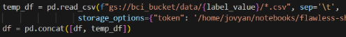
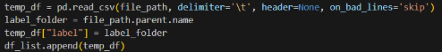

Overview: 

This project processes CSV files from a designated directory, extracts relevant data, and applies a Random Forest classifier to categorize data. It efficiently loads large amounts of tab-separated data and provides performance metrics for the trained model. 

Features: 

Efficiently processes up to 1000 CSV files

Implements batch processing to optimize runtime

Uses Random Forest Classifier for predictions

Prints classification report & accuracy score

Usage: 

The data should be on the same folder as the program located: Avatar/server. This will allow the program to look through each folder that has the .csv

Before optimization: 

After optimization: 

Original Author: Luis Aguilar 
